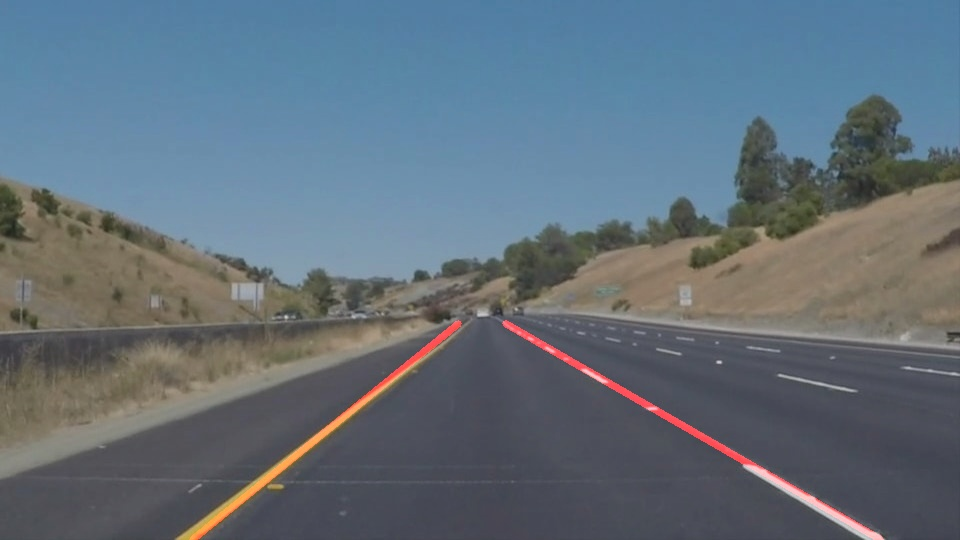

# **Finding Lane Lines on the Road**

This is my submission for the first project of the [Udacity self-driving car nanodegree](http://www.udacity.com/drive). In the first project, students are asked to create a Python program that uses OpenCV to identify lane lines in still images and videos taken from a camera mounted on the front of a car that is driving on a highway.  Below is a write-up of my work.

## Reflection

### Describe your pipeline.

My pipeline for static images consists of the following steps:

1. Detect edges in the image.
2. Detect areas in the image that are yellow or white.
3. Mark areas in the image that fall in the region-of-interest.
4. Calcuate the intersection (logical AND) of the results of 1-3 to get pixels potentially representing lane markers.
5. Perform a Probabilistic Hough Line Transform to find lines that may represent lane boundaries.
6. Use heuristics to identify left and right lane boundaries.

For videos, the above steps are applied to each frame, and then processed through the following algorithm:

<ol start="7">
<li>Compute the angle and *ymax-intercept* of the left and right lane boundaries for the first 5 frames, and take the median values to get the values to use for the first frame. The ymax-intercept is the x value of the line when it intersects the bottom of the image.</li>
<li>For frames other than the first, compute the angle and ymax-intercept for both lane lines for the frame, and move the values from the previous frame towards the new values by up to 1 degree and 2 pixels respectively.</li>
</ol>

Below is a more detailed breakdown of each step.

#### 1. Detect edges in the image
To detect edges, I start by converting the input image to grayscale and applying a Gaussian blur with a 5x5 kernel. Then I apply the canny edge detection algorithm. Tuning the algorithm, I found that the values 20 and 80 for the low and high thresholds (respectively) worked best. Finally, I apply a dilation with a 9x9 filter and an erosion with an 11x11 filter (which is equivalent to a morphological close followed by a slight erosion). These steps produce images like:

 

#### 2. Detect areas in the image that are yellow or white
To find white/yellow areas, I convert the input image to the HSV color space. To identify yellow areas, I filter for pixels that have a hue between 40&deg; and 80&deg;. To identify white areas, I filter for pixels that have a saturation less than 32 and a value more than 224. The final color mask is the union (logical OR) of these two, followed by a 9x9 morphological close. This produces images like:

 

#### 3. Mark areas in the image that fall in the region-of-interest
I use a trapezoidal region-of-interest that is 40% of the height of the image. The bottom is 100% of the width of the image and the top is 25% of the width of the image:

#### 4. Calcuate the intersection (logical AND) of the results of 1-3
This step produces results like:

 

#### 5. Perform a Probabilistic Hough Line Transform
I apply a Probabilistic Hough Line Transform using a resolution of 2 pixels for &rho; (rho) and a resolution of 1&deg; for &theta; (theta), with a minimum line length of 150 pixels and a maximum line gap of 70 pixels. This produces lines like:

 

#### 6. Use heuristics to identify left and right lane boundaries
I assume that the left lane will always be at an angle &theta; between 90&deg; and 180&deg; (i.e. going up and to the right), and that the left lane will always be at an angle &theta; between 0&deg; and 90&deg; (i.e. down and to the right). Then, I assume that the left and right lane lines will be represented by the lines that are closest to vertical (&theta; = 90&deg;) from all the candidates. This produces lane lines like:

 

#### 7, 8. Smooth lane lines across video frames
For videos, to prevent the lane lines from jumping around on frames that don't process correctly, I start by taking the median angle and ymax-intercept of the left and right lanes for the first 5 frames, and using these parameters to draw the lane lines for the first frame. Then on subsequent frames I compute the new angle and ymax-intercept for the frame, and move the values from the previous frame towards the new values, but limit the change so that the new angle is no more than 1&deg; from the previous angle, and the new ymax-intercept is no more than 1 pixel from the previous ymax-intercept. This produces results like below:

<video width="600" controls>
<source src="writeup_files/solidWhiteRight.mp4">
</video>
 
<video width="600" controls>
<source src="writeup_files/solidYellowLeft.mp4">
</video>
 
<video width="600" controls>
<source src="writeup_files/challenge.mp4">
</video>

### Identify potential shortcomings with your current pipeline

My pipeline makes many assumptions about the input images/files. If any of the assumptions are violated, the pipeline may fail to identify the lane lines. The assumptions include:

1. That the input files are 960x540 pixels (nearly every step in the processing pipeline depends on this).
2. That the camera is positioned where it is on the vehicle.
3. That the lighting is as it was when the videos were recorded (broad daylight).
4. That the road is fairly straight (no harepin turns) and the vehicle is pointed roughly straight down the road.
5. That the video occurs on a highway with lane markers on both sides of the lane, and not e.g. on a two-lane road without a right-side marker, or on a road that goes through an intersection (lane markers not present in the middle of the intersection).
6. That there are no other markings on the road.

Even with these assumptions, the pipeline fails to perform perfectly, especially on the challenge video. In particular, the section of the video where the road goes over a gray concrete bridge (which has a different color than the black asphalt in all the other inputs) confuses the pipeline because the lane lines have lower contrast against the background.

### Suggest possible improvements to your pipeline

One way to make my pipeline more robust would be to normalize for the video size and the overall brightness of the image. Another way would be to use a neural network trained on a large number of tagged inputs to identify the locations of lane markers in the input.
